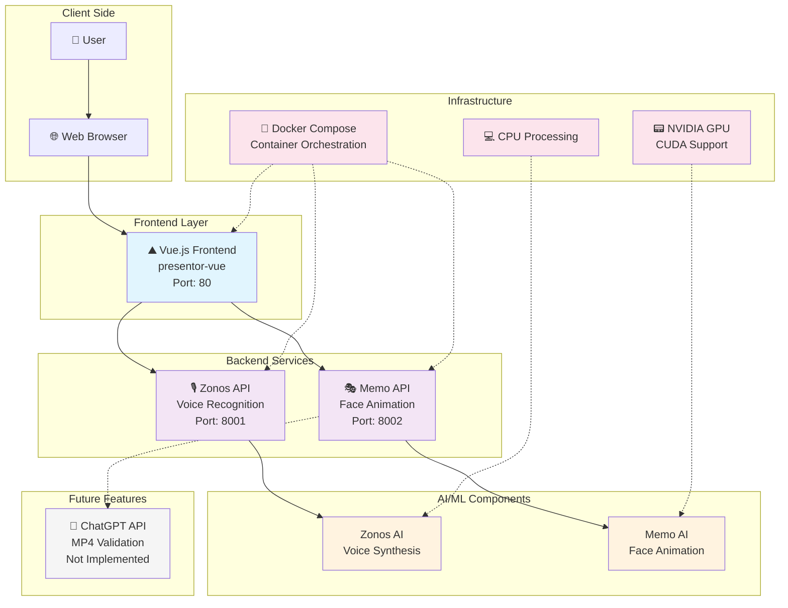

# Architecture

```mermaid
graph TB
    subgraph "Client Side"
        User[👤 User]
        Browser[🌐 Web Browser]
    end

    subgraph "Frontend Layer"
        Vue[⛰️ Vue.js Frontend<br/>presentor-vue<br/>Port: 80]
    end

    subgraph "Backend Services"
        ZonosAPI[🎙️ Zonos API<br/>Voice Recognition<br/>Port: 8001]
        MemoAPI[🎭 Memo API<br/>Face Animation<br/>Port: 8002]
    end

    subgraph "AI/ML Components"
        ZonosAI[Zonos AI<br/>Voice Synthesis]
        MemoAI[Memo AI<br/>Face Animation]
    end

    subgraph "Future Features"
        ChatGPT[🤖 ChatGPT API<br/>MP4 Validation<br/>Not Implemented]
    end

    subgraph "Infrastructure"
        Docker[🐳 Docker Compose<br/>Container Orchestration]
        GPU[📟 NVIDIA GPU<br/>CUDA Support]
        CPU[💻 CPU Processing]
    end

    User --> Browser
    Browser --> Vue
    Vue --> ZonosAPI
    Vue --> MemoAPI

    ZonosAPI --> ZonosAI
    MemoAPI --> MemoAI

    MemoAPI -.-> ChatGPT

    Docker -.-> Vue
    Docker -.-> ZonosAPI
    Docker -.-> MemoAPI

    GPU -.-> MemoAI
    CPU -.-> ZonosAI

    classDef frontend fill:#e1f5fe
    classDef backend fill:#f3e5f5
    classDef ai fill:#fff3e0
    classDef future fill:#f5f5f5
    classDef infra fill:#fce4ec

    class Vue frontend
    class ZonosAPI,MemoAPI backend
    class ZonosAI,MemoAI ai
    class ChatGPT,VideoValidation future
    class Docker,GPU,CPU infra
```

<Footer />

